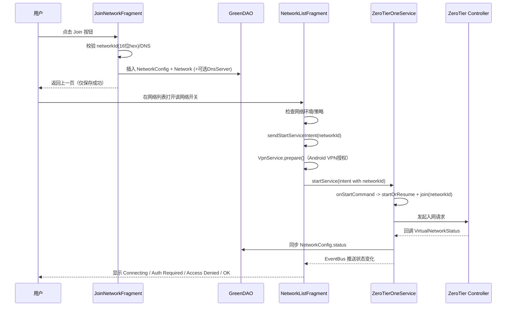

1. **时序图**

```mermaid
sequenceDiagram
    participant U as 用户
    participant J as JoinNetworkFragment
    participant DB as GreenDAO
    participant L as NetworkListFragment
    participant S as ZeroTierOneService
    participant C as ZeroTier Controller

    U->>J: 点击 Join 按钮
    J->>J: 校验 networkId(16位hex)/DNS
    J->>DB: 插入 NetworkConfig + Network (+可选DnsServer)
    J-->>U: 返回上一页（仅保存成功）

    U->>L: 在网络列表打开该网络开关
    L->>L: 检查网络环境/策略
    L->>L: sendStartServiceIntent(networkId)
    L->>L: VpnService.prepare()（Android VPN授权）
    L->>S: startService(intent with networkId)

    S->>S: onStartCommand -> startOrResume + join(networkId)
    S->>C: 发起入网请求
    C-->>S: 回调 VirtualNetworkStatus
    S->>DB: 同步 NetworkConfig.status
    S-->>L: EventBus 推送状态变化
    L-->>U: 显示 Connecting / Auth Required / Access Denied / OK

```
老项目关键点：

Join 页点击按钮只做存储，不触发 Service 启动。
真正连接入口在列表页开关事件。
ZeroTier 服务器授权通过 VirtualNetworkStatus.AUTHENTICATION_REQUIRED / ACCESS_DENIED / OK 体现。
状态回调会写回 DB，再由 UI 刷新显示。